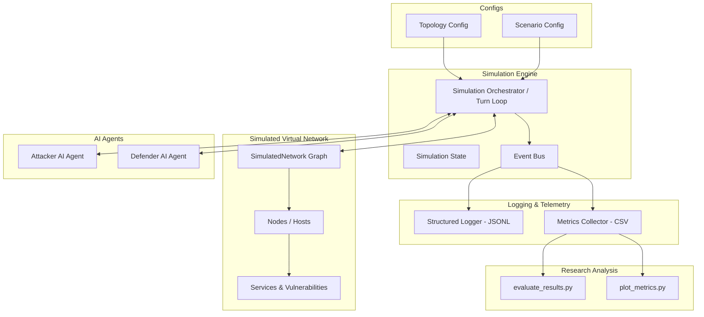

# Simulated AI Cybersecurity Research Framework

An academic simulation framework designed to model and evaluate **AI Attacker vs. AI Defender** dynamics within a simulated enterprise network.

> **Safety Notice**: This project is 100% simulated in software using graph representations. No real packets are transmitted, no real systems or vulnerabilities are probed or exploited, and no external networks are contacted.

---

## High-Level Architecture



---

## Directory & File Tree

```
TDR-IA-CIBERSEGURETAT/
├── configs/
│   ├── network_topologies/
│   │   └── default_topology.yaml
│   ├── scenarios/
│   │   └── basic_scenario.yaml
│   └── simulation_config.yaml
├── data/
│   ├── logs/
│   │   └── .gitkeep
│   └── results/
│       └── .gitkeep
├── src/
│   ├── __init__.py
│   ├── environment/
│   │   ├── __init__.py
│   │   ├── network.py
│   │   ├── node.py
│   │   └── service.py
│   ├── agents/
│   │   ├── __init__.py
│   │   ├── base_agent.py
│   │   ├── attacker/
│   │   │   ├── __init__.py
│   │   │   ├── actions.py
│   │   │   └── attacker_agent.py
│   │   └── defender/
│   │       ├── __init__.py
│   │       ├── actions.py
│   │       └── defender_agent.py
│   ├── simulation/
│   │   ├── __init__.py
│   │   ├── engine.py
│   │   ├── events.py
│   │   └── state.py
│   ├── telemetry/
│   │   ├── __init__.py
│   │   ├── logger.py
│   │   └── metrics.py
│   └── utils/
│       ├── __init__.py
│       └── config_loader.py
├── analysis/
│   ├── evaluate_results.py
│   └── plot_metrics.py
├── tests/
│   ├── __init__.py
│   ├── test_agents.py
│   ├── test_environment.py
│   └── test_simulation.py
├── .gitignore
├── main.py
├── requirements.txt
└── README.md
```

---

## Purpose of Every File

### Root Files
- **`main.py`**: Command-line entry point to run simulations, parse configuration flags, set random seeds, and trigger the execution pipeline.
- **`requirements.txt`**: Declares required Python libraries (`pyyaml`, `networkx`, `pandas`, `matplotlib`, `pytest`, etc.).
- **`.gitignore`**: Excludes temporary files, caches, virtual environments, and generated test logs/data from Git version control.
- **`README.md`**: Project overview, architecture diagrams, and system documentation.

### Configuration (`configs/`)
- **`configs/simulation_config.yaml`**: Global settings such as max turns/ticks, random seeds, logging levels, and output destinations.
- **`configs/network_topologies/default_topology.yaml`**: Defines virtual network graphs (subnets, nodes, IP assignments, services, firewall access rules) in a human-readable format.
- **`configs/scenarios/basic_scenario.yaml`**: Defines experiment scenarios, victory/loss conditions, starting attacker knowledge, target high-value assets, and reward penalties.

### Data Storage (`data/`)
- **`data/logs/`**: Directory where detailed event logs (`.jsonl` files) are written during simulation runs.
- **`data/results/`**: Directory where aggregated run metrics (`.csv` files) and summary plots are stored.

### Source Code (`src/`)

#### 1. Environment Abstraction (`src/environment/`)
- **`src/environment/__init__.py`**: Exposes environment classes (`Service`, `Vulnerability`, `Node`, `SimulatedNetwork`).
- **`src/environment/service.py`**: Models simulated network services (e.g. HTTP, SSH, SQL), port numbers, running state, and known mock vulnerabilities (e.g. CVE IDs).
- **`src/environment/node.py`**: Models a simulated host (workstation, server, router), tracking IP, OS, open ports, compromise status, and isolation state.
- **`src/environment/network.py`**: Models the virtual network topology using a graph structure (`NetworkX`), validating reachability, subnet boundaries, and simulated firewall rules.

#### 2. AI Agents (`src/agents/`)
- **`src/agents/__init__.py`**: Exposes agent classes.
- **`src/agents/base_agent.py`**: Abstract base class (`BaseAgent`) defining standard methods (`observe`, `select_action`, `reset`) for any agent implementation.
- **`src/agents/attacker/actions.py`**: Enumerations and data structures for attacker actions (e.g., `RECON_SCAN`, `EXPLOIT_SERVICE`, `LATERAL_MOVE`, `EXFILTRATE_DATA`).
- **`src/agents/attacker/attacker_agent.py`**: Skeleton of the attacker AI agent; maintains knowledge of discovered hosts and decides offensive actions.
- **`src/agents/defender/actions.py`**: Enumerations and data structures for defender actions (e.g., `ANALYZE_TELEMETRY`, `ISOLATE_NODE`, `PATCH_VULNERABILITY`, `BLOCK_IP`).
- **`src/agents/defender/defender_agent.py`**: Skeleton of the defender AI agent; processes telemetry logs, detects anomalies, and triggers remediation.

#### 3. Simulation Engine (`src/simulation/`)
- **`src/simulation/__init__.py`**: Exposes simulation orchestration components.
- **`src/simulation/state.py`**: Data structure tracking state snapshot at tick $t$ (compromised hosts count, active threats, termination status, winner).
- **`src/simulation/events.py`**: Standardized data structure for discrete events emitted when agents take actions or states mutate.
- **`src/simulation/engine.py`**: Core loop orchestrator; advances discrete time ticks, collects agent choices, enforces environment rules, and validates completion.

#### 4. Telemetry & Logging (`src/telemetry/`)
- **`src/telemetry/__init__.py`**: Exposes telemetry tools.
- **`src/telemetry/logger.py`**: Writes structured JSON-Lines (`.jsonl`) logs for every simulated event and action to guarantee auditability.
- **`src/telemetry/metrics.py`**: Computes quantitative research metrics (Mean Time to Detect - MTTD, Attack Success Rate, False Positive Rate) and exports to CSV.

#### 5. Utilities (`src/utils/`)
- **`src/utils/__init__.py`**: Exposes utility functions.
- **`src/utils/config_loader.py`**: Parses YAML configuration files into instantiated object representations.

### Research Analysis & Visualization (`analysis/`)
- **`analysis/evaluate_results.py`**: Batch processing script that loads CSV metrics and computes statistical summaries (mean, standard deviation, percentiles).
- **`analysis/plot_metrics.py`**: Visualization script generating publication-ready figures (detection curves, compromise timelines) for the research paper.

### Tests (`tests/`)
- **`tests/__init__.py`**: Package marker for test suite.
- **`tests/test_environment.py`**: Unit tests verifying node properties, service states, and firewall routing rules.
- **`tests/test_agents.py`**: Unit tests verifying that agents conform to the base interface and valid action spaces.
- **`tests/test_simulation.py`**: Unit tests verifying engine step transitions and win/loss condition evaluations.
